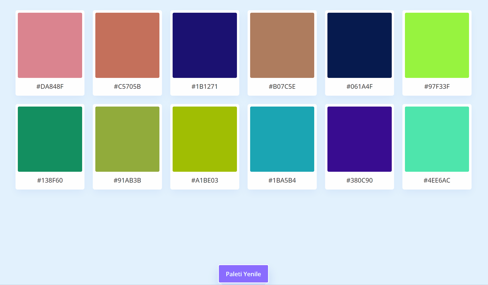

<h1>Renk Paleti</h1>

Rastgele renk paleti oluşturan uygulama

<h2>Uygulama kullanım bilgisi</h2>

Dinamik olarak oluşan 12 adet renkten oluşan paletin herhangi bir öğeye mouse ile tıklandığında o renk kopyalanıp kullanılabilir, paleti yenile düğmesine tıklanılınca yeni rastgele 12 renk oluşur.

<a href="#">renkpaleti.com</a>

<h3>Ekran Görüntüsü</h3>

 